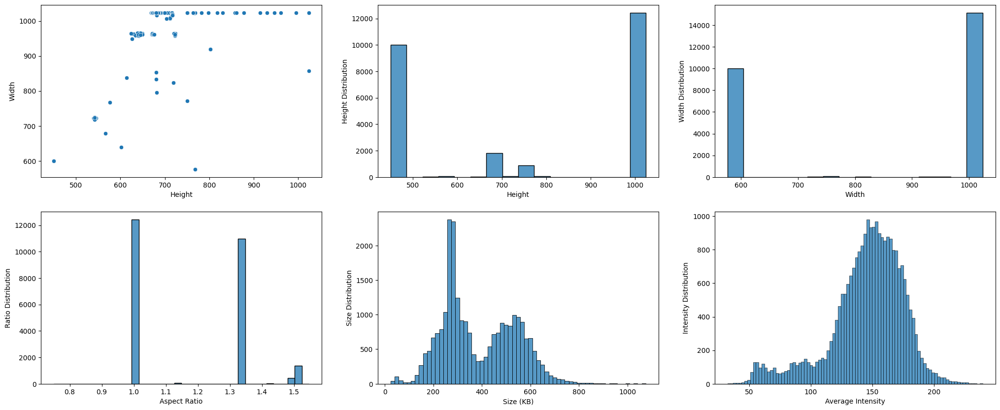
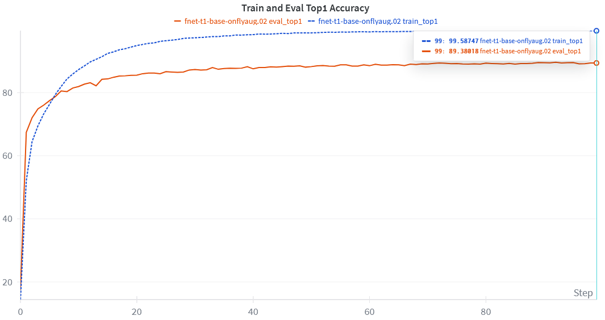
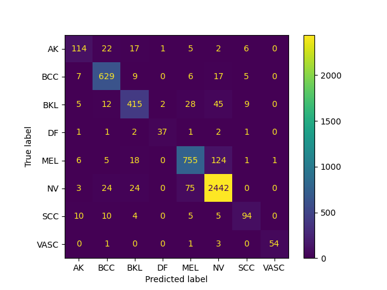
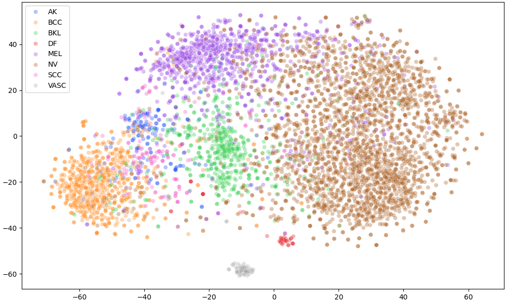

## Skin Lesion Classification

This project classifies 8 different types of **skin lesions** using efficient **lightweight** mobile architectures. In all baselines, we managed to achieve at least **87%** validation accuracy.

## Model Selection

We chose various deep learning models that are strong contenders for being **lightweight** while also giving high accuracies.

-   [MobileNetv3](references/MobileNetV3.pdf)
-   [FasterNet](references/FasterNet.pdf)
-   [shViT](references/shViT.pdf)
-   [EfficientViT](references/EfficientViT.pdf)

## Dataset

We decided to choose a difficult dataset known as [ISIC-2019](https://challenge.isic-archive.com/data/#2019). It provides various skin lesion categories and contains heavy **class imbalance**. Here are examples of the different categories.

## Exploratory Data Analysis

This image below shows the various **statistics** of the [ISIC-2019](https://challenge.isic-archive.com/data/#2019) training set.

## FasterNet Baseline Results

Here we show the baseline results for [FasterNet](references/FasterNet.pdf) as it's the best model with the highest reported validation accuracy of **89.3%**.

### Top-1 Training and Validation Accuracy

Here are the training and validation **accuracies** for the different epochs.

### Confusion Matrix

From the **confusion matrix**, it's clear that some classes are difficult to distinguish due to high **inter-class variation**.

### TSNE

We also investigate the **tsne** plot to ensure that embeddings are well separated near the classification layer. It also shows us which categories are similar to each other.

## Current experiments

-   Experimenting with various **late feature fusion** strategies.
-   Then experiment with hierarchical bilinear pooling fusion **(HBP)**.

## Acknowledgements

-   [ISIC-2019](https://challenge.isic-archive.com/data/#2019) authors for their provided dataset.
-   [PyTorch Image Models](https://timm.fast.ai/) for the various pretrained models on **ImageNet**.
